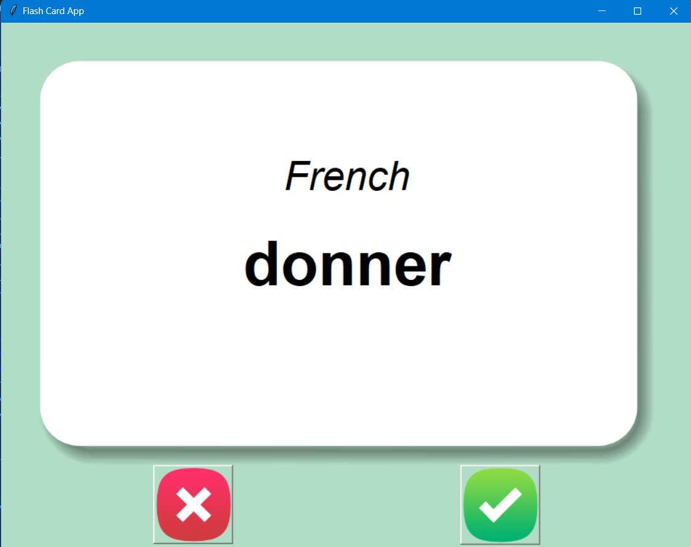
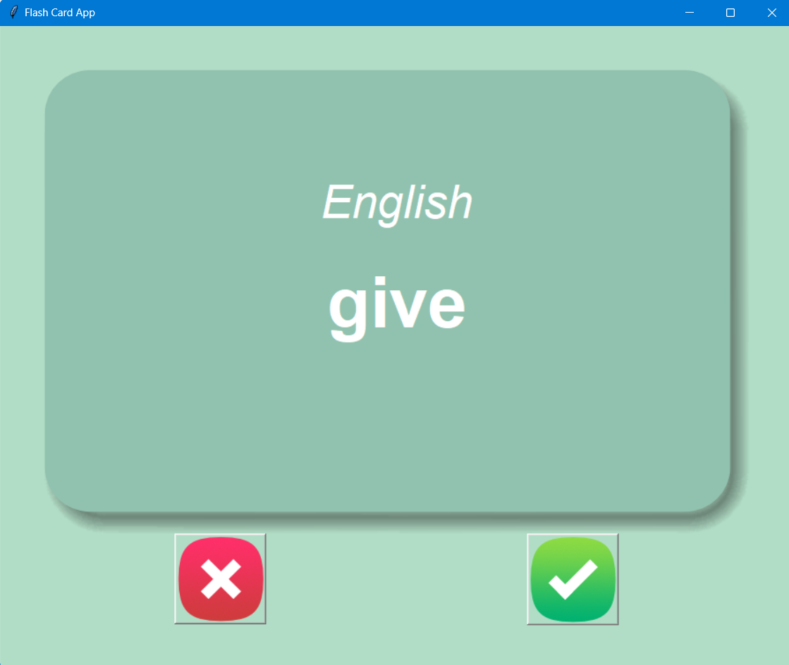

# Flash Card App
Flash Card App is an interactive language learning tool built using Python's Tkinter module. In this app, players can test their knowledge of French words by flipping flash cards to reveal their English translations.

# Screenshot



## Requirements

- Python 3.x
- `pandas`, `tkinter` and `random` module (included with Python's standard library)

## How to Run
1. Clone the repository:
```bash
git clone https://github.com/itssahillwhat/Python Projects.git
```
2. Navigate to the project directory:
```bash
cd Flash Card App
```
3. Run the game:
```bash
python main.py
```

## Notes
* **Flash Card Mechanics:**
    * The app displays a flash card with a French word.
    * After 3 seconds, the card flips to reveal the English translation.
    * Use the right button to mark the word as known, removing it from the list of words to learn.
    * Use the wrong button to keep the word in the study list.
    * The aim is to learn all the words by repeatedly testing yourself.

* **Data Persistence:**
    * The words you have learned are saved in the `words_to_learn.csv` file for future sessions.
    * The app will load the `words_to_learn.csv` file if it exists, otherwise it will start with the `french_words.csv` file.

* **Data Format:**

  * The `french_words.csv` file should be in the following format:
    ```csv
    French,English
    chaque,each
    parler,speak
    arriver,come
    ```
* **Customization Options:**

  * You can customize the list of words by editing the `french_words.csv` file.
  * The display time for the flash cards and other settings can be adjusted in the script.


## Helpful Links

* [Wiktionary Frequency Lists](https://en.wiktionary.org/wiki/Wiktionary:Frequency_lists)

* [2018 Frequency Lists from Hermit Dave](https://github.com/hermitdave/FrequencyWords/tree/master/content/2018)

* [Open Subtitles](https://www.opensubtitles.org/en/search/subs)

* [Google Translate for Google Sheets](https://support.google.com/docs/answer/3093331?hl=en-GB)

* [Google Sheets](https://www.google.co.uk/sheets/about/)

* [Google Translate Language Codes](https://cloud.google.com/translate/docs/languages?hl=en)

## Contributing
Contributions to this project are welcome! Here are some ways you can contribute:

* Report bugs or suggest new features by opening an issue.
* Fork the repository, make your changes, and submit a pull request.

Please make sure to update tests as appropriate and follow the existing code style.
