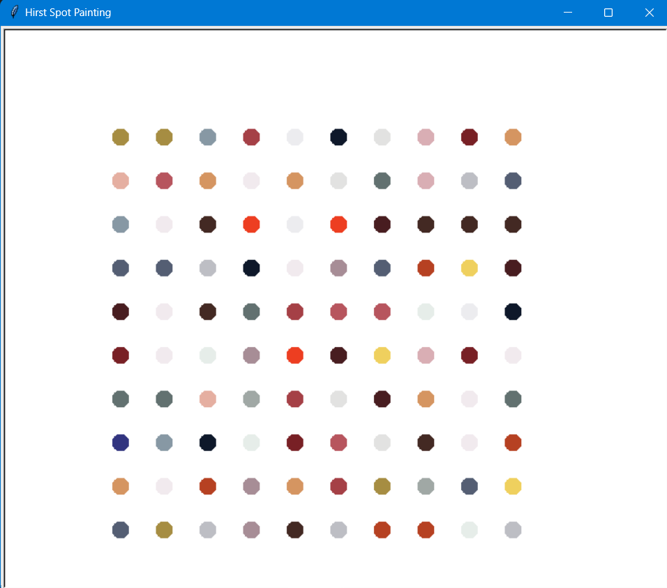

# Hirst Spot Painting
This project creates a simple replication of Damien Hirst's spot paintings using Python's Turtle graphics module and the Colorgram library to extract colors from an image.

## Screenshot


## Overview
The project extracts colors from an image file named Hirst Spot.jpg and uses these colors to draw a grid of colored dots on the screen. The dots are placed in a 10x10 grid pattern with random colors chosen from the extracted color palette.

## Requirements
* Python 3.x
* Turtle Graphics (`turtle` module, included with Python)
* Colorgram library

## Installation
First, ensure you have Python 3.x installed. Then, install the Colorgram library using pip:

```shell
pip install colorgram.py
```

## How to Run

1. **Clone the Repository:**

   ```sh
   git clone https://github.com/itssahillwhat/Python-Projects.git
   cd Hirst Spot Painting
   ```

2. **Run the Script:**

   ```sh
   python main.py
   ```

## Usage
1. Place an image named Hirst Spot.jpg in the same directory as the script.
2. Run the script. It will create a 10x10 grid of colored dots using colors extracted from the image.

## Notes
* The image file Hirst Spot.jpg should be placed in the same directory as the script.
* You can adjust the size of the grid, dot size, and spacing by modifying the script.

## Helpful Links

* [Turtle Graphics Documentation](https://docs.python.org/3/library/turtle.html)

* [Trinket Turtle Colours](https://trinket.io/docs/colors)

* [Turtle Colours](https://cs111.wellesley.edu/reference/colors)

* [What is a Random Walk?](https://en.wikipedia.org/wiki/Random_walk)

* [RGB Tool from W3Schools](https://www.w3schools.com/colors/colors_rgb.asp)

* [Colorgram Package](https://pypi.org/project/colorgram.py/)

## Contributing
Contributions to this project are welcome! Here are some ways you can contribute:

* Report bugs or suggest new features by opening an issue.
* Fork the repository, make your changes, and submit a pull request.

Please make sure to update tests as appropriate and follow the existing code style.

Enjoy creating your Hirst-inspired spot painting!
