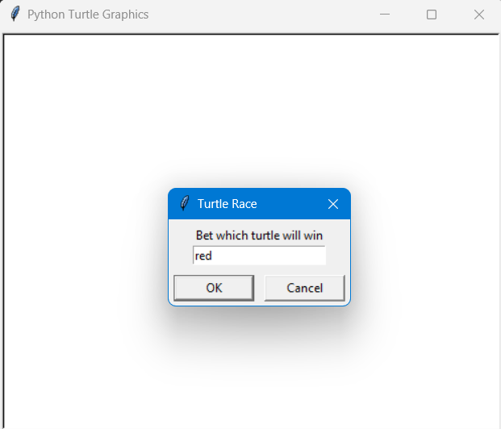

# Turtle Race

This mini project simulates a turtle race using Python's `turtle` graphics module. Users can place bets on which turtle they think will win the race. The race involves multiple turtles moving randomly across the screen, and the first turtle to reach the finish line wins.

## Screenshot



## Requirements

- Python 3.x
- `turtle` module (included with Python's standard library)

## How to Run

1. **Clone the Repository:**

   ```sh
   git clone https://github.com/itssahillwhat/Python-Projects.git
   cd Turtle Race
   ```

2. **Run the Script:**

   ```sh
   python main.py
   ```

3. **Place Your Bet:**

   - A dialog box will appear asking you to enter the color of the turtle you want to bet on. Choose from the following colors: `red`, `orange`, `yellow`, `green`, `blue`, `violet`.

4. **Watch the Race:**

   - The turtles will start racing towards the right side of the screen. The first turtle to reach the end of the screen (x-coordinate ≥ 230) is the winner.
   - A message will be displayed in the console indicating whether you won or lost the bet based on the color of the winning turtle.

## Notes
* **Customization Options:**
    1. Turtle Colors: You can change the `colors` list to include any other colors you prefer.
    2. Starting Positions: Adjust the `y_corr` list to modify the starting y-coordinates of the turtles.
    3. Race Distance: Change the x-coordinate condition in the while loop to alter the length of the race.
* **Turtle Speed:** The turtles move forward by a random distance between 0 and 10 units in each loop iteration. This randomness simulates the unpredictability of a real race.

## Helpful Links
* [The listen method](https://docs.python.org/3/library/turtle.html#turtle.listen)

* [Turtle.textinput documentation](https://docs.python.org/3.1/library/turtle.html#turtle.textinput)

## Contributing
Contributions to this project are welcome! Here are some ways you can contribute:

* Report bugs or suggest new features by opening an issue.
* Fork the repository, make your changes, and submit a pull request.

Please make sure to update tests as appropriate and follow the existing code style.

Enjoy your turtle race game!
